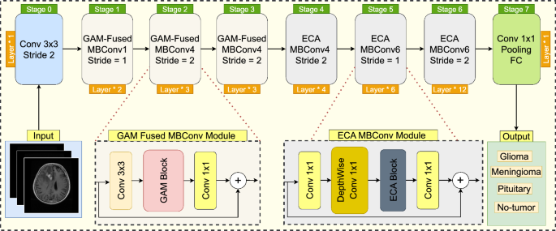

# Breast Classification

담당자: 영섭 이
진행 상태: 완료
프로젝트: NIPA (https://www.notion.so/NIPA-28842971c02f80ea8a94f53b5f0fcf47?pvs=21)
git repositories: https://github.com/Leeyoungsup/NIPA_model

# DataSet

 **NIA 2024 유방암 병리 이미지 및 판독문 합성데이터**

### **소개**

유방암 병리 패치 합성 이미지 및 셀 세그멘테이션, 판독문 라벨링 데이터를 구축함. 유방암 병리 패치 합성 이미지는 정상유방조직, 상피내암, 침윤암으로 구성하여 총 2만 건을 구축하였음.

### **구축목적**

다양한 병리학적 유형, 아형을 포함한 유방암의 전체 슬라이드로부터 추출되는 병리 패치 이미지에 대하여 라벨링된 데이터 및 병리학적 정보를 확보하여 인공지능 학습용 고품질 합성 이미지 및 판독문 데이터를 구축하고자 함.

## 메타데이터 구조표

| **데이터 영역** | 헬스케어 | **데이터 유형** | 이미지 |
| --- | --- | --- | --- |
| **데이터 형식** | PNG | **데이터 출처** | (의료)길의료재단(가천대 길병원), 가톨릭대학교 산학협력단(가톨릭대학교 서울성모병원, 의정부성모병원, 성빈센트병원), 고려대학교 산학협력단(고려대학교 안암병원), 아주대학교 산학협력단(아주대학교 병원) 수집 |
| **라벨링 유형** | 셀 세그멘테이션(이미지), 판독문(자연어) | **라벨링 형식** | JSON |
| **데이터 활용 서비스** | AI 기반 병리 진단 보조 솔루션 | **데이터 구축년도/데이터 구축량** | 2024년/20,000건 |

## 데이터 통계

### 데이터 구축 규모

**○ 유방암 병리 이미지 및 판독문 합성데이터 : 2만 건**

| **데이터명** | **분류** | **라벨링 유형** | **객체수** | **수량** | **단위** |
| --- | --- | --- | --- | --- | --- |
| 유방암 병리 이미지 및 판독문 합성데이터 | 정상유방조직 | Polygon | 11,087,555 | 6,500 | 장 |
|  | 상피내암 | Polygon | 13,229,635 | 6,500 | 장 |
|  | 침윤암 | Polygon | 14,318,015 | 7,000 | 장 |
| 총수량 |  |  |  | 20,000 | 장 |

### 데이터 분포

**○ 유방암 병리 이미지 및 판독문 합성데이터 암종별 분포**

- 정상유방조직 : 6,500장
- 상피내암 : 6,500장
- 침윤암 : 7,000장

# Model

Effcient Net V2

# Training

## BRNT : Breast Normal Tissue (정상 유방 조직)

## BRID : Breast Intraductal Carcinoma ****(상피내암)

## BRIL : Breast Invasive Lobular Carcinoma (Lobular타입 침윤암)

## BRLC : Breast Lobular Carcinoma **(상피내암)**

## BRDC : Breast Ductal Carcinoma **(침윤성 유방암)**

# 📊 Test Set Performance Results

Overall Accuracy: 0.9002 (90.02%)
Macro Average - Precision: 0.8940, Recall: 0.8596, F1-Score: 0.8727
Weighted Average - Precision: 0.9018, Recall: 0.9002, F1-Score: 0.8983

## 📋 Per-Class Performance:

Class  Precision  Recall  F1-Score  Support
BRNT     0.9582  0.9662    0.9622      711
BRID     0.8224  0.9449    0.8794      490
BRIL     0.8483  0.6509    0.7366      232
BRLC     0.9282  0.8227    0.8723      220
BRDC     0.9131  0.9131    0.9131      472

## 🔄 Confusion Matrix:

# WSI prediction