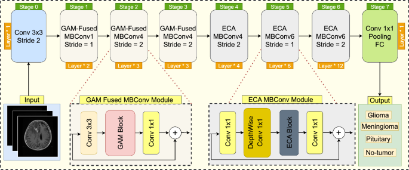

# Stomach Classification

담당자: 영섭 이
진행 상태: 완료
프로젝트: NIPA (https://www.notion.so/NIPA-28842971c02f80ea8a94f53b5f0fcf47?pvs=21)
git repositories: https://github.com/Leeyoungsup/NIPA_model

# DataSet

 **NIA 2024 위암 병리 이미지 및 판독문 합성데이터**

## **소개**

위암 병리 패치 합성 이미지 및 셀 세그멘테이션, 판독문 라벨링 데이터를 구축함. 위암 병리 패치 합성 이미지는 위염, 장형선암, 미만형선암, 혼합형선암으로 구성하여 총 1만 건을 구축하였음.

## **구축목적**

다양한 병리학적 유형, 아형을 포함한 위암 전체 슬라이드로부터 추출되는 병리 패치 이미지에 대하여 라벨링된 데이터 및 병리학적 정보를 확보하여 인공지능 학습용 고품질 합성 이미지 및 판독문 데이터를 구축하고자 함

## 메타데이터 구조표

| **데이터 영역** | 헬스케어 | **데이터 유형** | 이미지 |
| --- | --- | --- | --- |
| **데이터 형식** | PNG | **데이터 출처** | (의료)길의료재단(가천대 길병원), 가톨릭대학교 산학협력단(가톨릭대학교 서울성모병원, 의정부성모병원, 성빈센트병원), 고려대학교 산학협력단(고려대학교 안암병원), 아주대학교 산학협력단(아주대학교 병원) 수집 |
| **라벨링 유형** | 셀 세그멘테이션(이미지), 판독문(자연어) | **라벨링 형식** | JSON |
| **데이터 활용 서비스** | AI 기반 병리 진단 보조 솔루션 | **데이터 구축년도/데이터 구축량** | 2024년/10,000건 |

## 데이터 통계

### 1. 데이터 구축 규모

**○ 위암 병리 이미지 및 판독문 데이터 : 1만 건**

| **데이터명** | **분류** | **라벨링 유형** | **객체수** | **수량** | **단위** |
| --- | --- | --- | --- | --- | --- |
| 위암 병리 이미지 및 판독문 합성데이터 | 위염 | Polygon | 6,120,252 | 2,500 | 장 |
|  | 장형선암 | Polygon | 5,188,329 | 2,500 | 장 |
|  | 미만형선암 | Polygon | 5,350,044 | 2,500 | 장 |
|  | 혼합형선암 | Polygon | 5,095,887 | 2,500 | 장 |
| 총수량 |  |  |  | 10,000 | 장 |

### 2. 데이터 분포

**○ 위암 병리 이미지 및 판독문 합성데이터 암종별 분포**

- 위염 : 2,500장
- 장형선암 : 2,500장
- 미만형선암 : 2,500장
- 혼합형선암 : 2,500장

# Model

Effcient Net V2

# Training

## STNT : Stomach Non-Tumor (정상 위 점막 조직)

## STDI : **Stomach Differentiated-type Adenocarcinoma** (장형선암)

## STIN : **Stomach Diffuse-type Adenocarcinoma** (미만형선암)

## STMX : **Stomach Mixed-type Adenocarcinoma (장형 + 미만형 혼합)**

# Test Set Performance Evaluation

# 📊 Test Set Performance Results

Overall Accuracy: 0.8475 (84.75%)
Macro Average - Precision: 0.8606, Recall: 0.8469, F1-Score: 0.8492
Weighted Average - Precision: 0.8577, Recall: 0.8475, F1-Score: 0.8482

## 📋 Per-Class Performance:

Class  Precision  Recall  F1-Score  Support
STNT     0.8873  0.9173    0.9020      266
STDI     0.9847  0.7569    0.8559      255
STIN     0.8090  0.8826    0.8442      264
STMX     0.7613  0.8310    0.7946      284

## 🔄 Confusion Matrix:

# WSI prediction