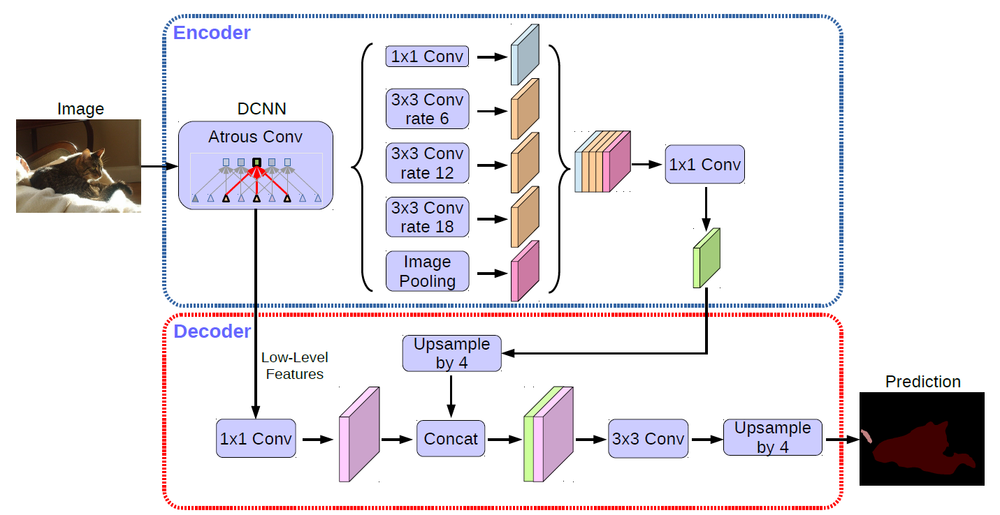

# Stomach Segmentation

담당자: 영섭 이
진행 상태: 완료
프로젝트: NIPA (https://www.notion.so/NIPA-28842971c02f80ea8a94f53b5f0fcf47?pvs=21), H&E 레벨 바이오마커 AI (https://www.notion.so/H-E-AI-26142971c02f8019860cefd1752d89d3?pvs=21)
git repositories: https://github.com/Leeyoungsup/NIPA_model

# DataSet

 **NIA 2024 위암 병리 이미지 및 판독문 합성데이터**

## **소개**

위암 병리 패치 합성 이미지 및 셀 세그멘테이션, 판독문 라벨링 데이터를 구축함. 위암 병리 패치 합성 이미지는 위염, 장형선암, 미만형선암, 혼합형선암으로 구성하여 총 1만 건을 구축하였음.

## **구축목적**

다양한 병리학적 유형, 아형을 포함한 위암 전체 슬라이드로부터 추출되는 병리 패치 이미지에 대하여 라벨링된 데이터 및 병리학적 정보를 확보하여 인공지능 학습용 고품질 합성 이미지 및 판독문 데이터를 구축하고자 함

## 메타데이터 구조표

| **데이터 영역** | 헬스케어 | **데이터 유형** | 이미지 |
| --- | --- | --- | --- |
| **데이터 형식** | PNG | **데이터 출처** | (의료)길의료재단(가천대 길병원), 가톨릭대학교 산학협력단(가톨릭대학교 서울성모병원, 의정부성모병원, 성빈센트병원), 고려대학교 산학협력단(고려대학교 안암병원), 아주대학교 산학협력단(아주대학교 병원) 수집 |
| **라벨링 유형** | 셀 세그멘테이션(이미지), 판독문(자연어) | **라벨링 형식** | JSON |
| **데이터 활용 서비스** | AI 기반 병리 진단 보조 솔루션 | **데이터 구축년도/데이터 구축량** | 2024년/10,000건 |

## 데이터 통계

### 1. 데이터 구축 규모

**○ 위암 병리 이미지 및 판독문 데이터 : 1만 건**

| **데이터명** | **분류** | **라벨링 유형** | **객체수** | **수량** | **단위** |
| --- | --- | --- | --- | --- | --- |
| 위암 병리 이미지 및 판독문 합성데이터 | 위염 | Polygon | 6,120,252 | 2,500 | 장 |
|  | 장형선암 | Polygon | 5,188,329 | 2,500 | 장 |
|  | 미만형선암 | Polygon | 5,350,044 | 2,500 | 장 |
|  | 혼합형선암 | Polygon | 5,095,887 | 2,500 | 장 |
| 총수량 |  |  |  | 10,000 | 장 |

### 2. 데이터 분포

**○ 위암 병리 이미지 및 판독문 합성데이터 암종별 분포**

- 위염 : 2,500장
- 장형선암 : 2,500장
- 미만형선암 : 2,500장
- 혼합형선암 : 2,500장

# Data Preprocessing

Image : png 형식의 20x 배율 1024x1024 패치이미지 

Label : npy형식의 1024 x 1024 x class 개수 배열 one-hot 구조

```python
#Stomach
integrated_class={
    "Background":0,
    "NT_stroma":1,
    "NT_Muscle":2,
    "NT_immune":3,
    "NT_epithelial":4,
    "NT_gastritis":5,
    "NT_intestinal_metaplasia":6,
    "Tumor":7,
    "Tumor_diffuse":8,
    "Tumor_intestinal":9
}
image_list=glob('../../data/NIPA/ST*/*.jpeg')
json_list=[f.replace('.jpeg','.json') for f in image_list]
class_count=len(integrated_class)
image_path='../../data/NIPA/stomach/images/'
mask_path='../../data/NIPA/stomach/masks/'
create_directory(image_path)
create_directory(mask_path)
for i in tqdm(range(len(image_list))):
    image=Image.open(image_list[i])
    width, height=image.size
    json_file=json.load(open(json_list[i]))
    mask=np.zeros((height,width,class_count),dtype=np.uint8)
    for j in range(len(json_file['content']['file']['objects'])):
        label_name=json_file['content']['file']['objects'][j]['label_nm']
        if label_name=="Cell_nucleus":
            continue
        channel_index=integrated_class[label_name]
        polygon=json_file['content']['file']['objects'][j]['coordinate']
        temp_mask = mask[:,:,channel_index].copy()
        mask[:,:,channel_index]=polygon2mask(polygon,temp_mask,1)
    mask[:,:,0]=1-(mask[:,:,1]|mask[:,:,2]|mask[:,:,3]|mask[:,:,4]|mask[:,:,5]|mask[:,:,6]|mask[:,:,7]|mask[:,:,8]|mask[:,:,9])
    total_mask = mask.sum(axis=-1) 
    if total_mask.max()>1:
        overlap_indices = np.where(total_mask>1)
        for idx in zip(*overlap_indices):
            # 우선순위: Tumor > NT_gastritis > NT_intestinal_metaplasia > NT_epithelial > NT_immune > NT_Muscle > NT_stroma
            # 가장 높은 우선순위 클래스만 남기고 나머지는 0으로 설정
            
            # Tumor 계열이 있으면 Tumor만 남기기
            if mask[idx[0], idx[1], 7] == 1 or mask[idx[0], idx[1], 8] == 1 or mask[idx[0], idx[1], 9] == 1:
                mask[idx[0], idx[1], 1:7] = 0  # NT 계열 모두 제거
                # Tumor 계열 중에서도 우선순위 적용 (Tumor_intestinal > Tumor_diffuse > Tumor)
                if mask[idx[0], idx[1], 9] == 1:  # Tumor_intestinal이 최우선
                    mask[idx[0], idx[1], 7] = 0
                    mask[idx[0], idx[1], 8] = 0
                elif mask[idx[0], idx[1], 8] == 1:  # Tumor_diffuse가 두번째
                    mask[idx[0], idx[1], 7] = 0
                    
            # Tumor가 없고 NT_gastritis가 있으면
            elif mask[idx[0], idx[1], 5] == 1:
                mask[idx[0], idx[1], 1:5] = 0
                mask[idx[0], idx[1], 6] = 0
                
            # NT_intestinal_metaplasia가 있으면
            elif mask[idx[0], idx[1], 6] == 1:
                mask[idx[0], idx[1], 1:6] = 0
                
            # NT_epithelial이 있으면
            elif mask[idx[0], idx[1], 4] == 1:
                mask[idx[0], idx[1], 1:4] = 0
                
            # NT_immune이 있으면
            elif mask[idx[0], idx[1], 3] == 1:
                mask[idx[0], idx[1], 1:3] = 0
                
            # NT_Muscle이 있으면
            elif mask[idx[0], idx[1], 2] == 1:
                mask[idx[0], idx[1], 1] = 0
    shutil.copy(image_list[i],image_path+os.path.basename(image_list[i]))
    np.save(mask_path+os.path.basename(image_list[i]).replace('.jpeg','.npy'),mask)

```

# Model



# Training


# Test Set Performance Evaluation

### Pixel Accuracy:

Mean ± Std: 0.8118 ± 0.1191
95% CI: [0.8046, 0.8189]
Min: 0.2315, Max: 0.9902

### Dice Score per Class:

Overall Mean Dice Score: 0.8311± 0.15

| Class  | Mean  | Std  | 95% CI(Confidence Interval) |
| --- | --- | --- | --- |
| Background | 0.6803 | 0.1859  | [0.6691, 0.6914] |
| NT_stroma  | 0.8241 | 0.2153  | [0.7992, 0.8491] |
| NT_Muscle  | 0.7286 | 0.3726 | [0.7062, 0.7510] |
| NT_immune   | 0.7265 | 0.3819 | [0.7036, 0.7495]  |
| NT_epithelial | 0.8947 | 0.2608 | [0.8790, 0.9104] |
| NT_gastritis  | 0.9821 | 0.0277 | [0.9777,0.9865] |
| NT_intestinal_metaplasia | 0.9480 | 0.1859 | [0.9369, 0.9592] |
| Tumor | 0.8530 | 0.2690 | [0.8368, 0.8691] |
| Tumor_diffuse | 0.8348 | 0.2992 | [0.8168, 0.8528] |
| Tumor_intestinal | 0.8325 | 0.3227 | [0.8131, 0.8519] |

# WSI prediction


